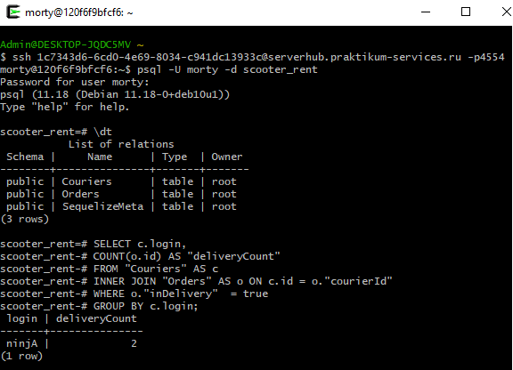
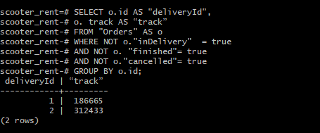
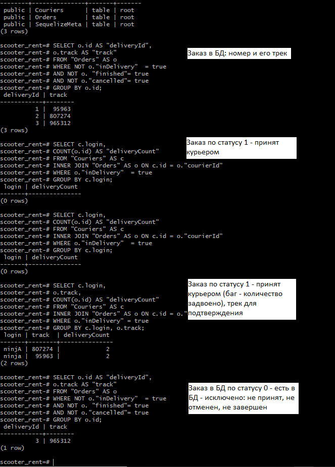

## Юлия Иванько, 34-я когорта — Финальный проект. 
## *Курс Инженер по тестированию плюс*

**Задание 1**

Представь: тебе нужно проверить, отображается ли созданный заказ в базе данных.

Для этого: выведи список логинов курьеров с количеством их заказов в статусе «В доставке» (поле inDelivery = true). 

**Решение**

SELECT c.login,   
    COUNT(o.id) AS "deliveryCount"   
FROM "Couriers" AS c   
INNER JOIN "Orders" AS o ON c.id = o."courierId"    
WHERE o."inDelivery"  = true   
GROUP BY c.login;  

### *Дополнение*
Между "Заданием 1" и "Для этого" наблюдается противоречие. 

В Требованиях (https://praktikum.notion.site/3eab94fe43444e70a5636ce07cb42f47) 
- `finished = true` -> `status = 2`
- `cancelled = true` -> `status = -1`
- `inDelivery = true` -> `status = 1`
- `Остальные случаи` -> `status = 0`
- `0` — заказ создан, больше ничего с ним не происходило;
- `1` — заказ принят курьером;
- `2` — заказ завершён;
- `-1` — заказ отменён.
Получается поле inDelivery = true не проверяет, отображается ли созданный заказ в базе данных, а учитывает взятые курьером заказы.

Если проигнорировать указание в параметре "Для этого", то *решение* по заданию:

SELECT o.id AS "deliveryId",   
o.track AS "track"  
FROM "Orders" AS o  
WHERE NOT o."inDelivery"  = true   
AND NOT o. "finished"= true  
AND NOT o."cancelled"= true  
GROUP BY o.id;

Скриншот-сравнение решений с комментариями
