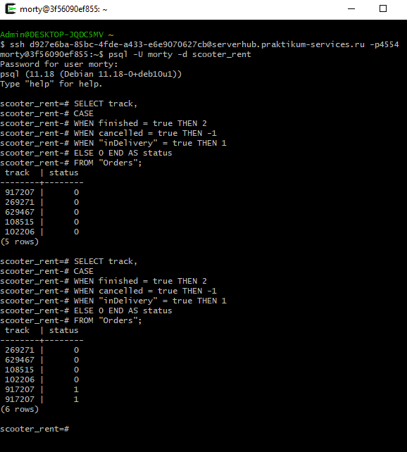
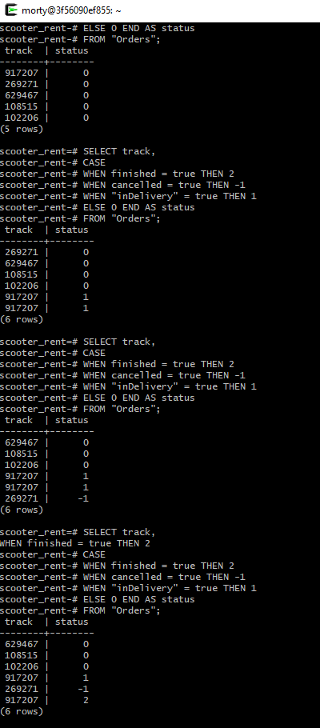

## Юлия Иванько, 34-я когорта — Финальный проект. 
## Инженер по тестированию плюс

**Задание 2**

Ты тестируешь статусы заказов. Нужно убедиться, что в базе данных они записываются корректно.

Для этого: выведи все трекеры заказов и их статусы. 

Статусы определяются по следующему правилу:

Если поле finished == true, то вывести статус 2.  
Если поле canсelled == true, то вывести статус -1.  
Если поле inDelivery == true, то вывести статус 1.  
Для остальных случаев вывести 0.  

**Решение**

SELECT track,   
    CASE   
        WHEN finished = true THEN 2   
        WHEN cancelled = true THEN -1   
        WHEN "inDelivery" = true THEN 1   
        ELSE 0   
    END AS status   
FROM "Orders";  

### *Скриншот-подтверждение после изменения статусов заказов в Postman.* 
Важно - трек задваивается, когда курьер принимает заказ (баг).

